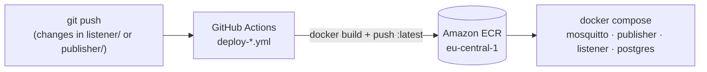

# Sensor Data Platform – CI/CD

Continuous delivery for the MQTT publisher and listener from
[iot-data-pipeline](https://github.com/alireza-mollaalihosseini/iot-data-pipeline) (personal project, July
2025). Each service is packaged as its own container image. GitHub Actions builds the image and pushes it
to Amazon ECR whenever that service's code changes, and `docker-compose.yml` runs the stack from the
published images.



## Workflows

| Workflow | Trigger (path filter) | Steps |
|---|---|---|
| `.github/workflows/deploy-publisher.yml` | `publisher/**` | checkout → AWS credentials from repository secrets → ECR login → build and push `publisher:latest` |
| `.github/workflows/deploy-listener.yml` | `listener/**` | same for `listener:latest` |

The path filters keep the two services independent: a change to one service only rebuilds that image.

## Structure

```
├── .github/workflows/     # one build-and-push workflow per service
├── publisher/             # publisher.py, Dockerfile.publisher, requirements.txt, wait-for-it.sh
├── listener/              # listener.py, Dockerfile.listener, requirements.txt, wait-for-it.sh
└── docker-compose.yml     # runs the stack from the ECR images
```

## Setup

1. Create two ECR repositories named `publisher` and `listener` in `eu-central-1`.
2. Add `AWS_ACCESS_KEY_ID` and `AWS_SECRET_ACCESS_KEY` as repository secrets, for an IAM user limited to
   pushing to those repositories.
3. Before the first run:
   * the workflows call `docker build ./listener` and `./publisher`, which looks for a file named
     `Dockerfile`, so rename `Dockerfile.listener` / `Dockerfile.publisher` (or add `-f` to the build
     command);
   * copy `mosquitto_config/` and `postgres/init.sql` from iot-data-pipeline next to
     `docker-compose.yml`, and set the image URIs there to
     `<aws_account_id>.dkr.ecr.eu-central-1.amazonaws.com/...`.
4. Push a change under `publisher/` or `listener/` to trigger a build, then run `docker compose up` on
   the target host (after `aws ecr get-login-password | docker login ...`).
